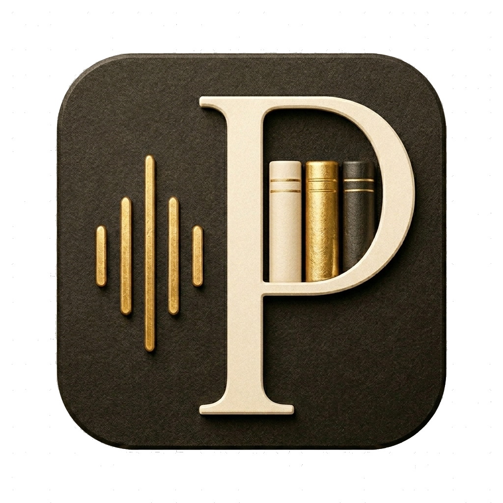

<p align="center">
  
</p>

# PodCodex

**Turn podcasts into a searchable knowledge base.**

Drop in an RSS feed, a YouTube channel, or a folder of recordings. PodCodex transcribes, diarizes, optionally translates, and indexes everything into a local vector store you can query by meaning. Plug it into a Discord bot or Claude Desktop and the whole archive becomes a conversational knowledge base.

> **Screenshots + 30 s demo coming with v0.1.0.** Tracked in [ROADMAP.md](ROADMAP.md).

---

## What it does

Point it at audio. Six steps, all on your machine:

1. **Ingest** — RSS, YouTube, or local folders. Manage multiple shows side by side.
2. **Transcribe** — WhisperX + pyannote diarization, word-level timestamps.
3. **Correct** — fix transcription errors with an LLM (Ollama, OpenAI, Anthropic, Mistral, or manual).
4. **Translate** — any target language via the same backends.
5. **Synthesize** *(optional)* — Qwen3-TTS voice cloning for dubbed versions.
6. **Index & search** — local LanceDB index, hybrid retrieval (vector ANN + BM25 FTS).

Every save is archived as a versioned snapshot with full provenance: model, params, content hash. Roll back any step.

---

## Get it

### Pre-built release

Direct download (latest):

- **macOS (Apple Silicon)** — [PodCodex-macos-arm64.dmg](https://github.com/gabriel-jung/podcodex/releases/latest/download/PodCodex-macos-arm64.dmg)
- **Windows x64** — [PodCodex-windows-x64.msi](https://github.com/gabriel-jung/podcodex/releases/latest/download/PodCodex-windows-x64.msi)

All assets + checksums on the [Releases](https://github.com/gabriel-jung/podcodex/releases) page.

**macOS quarantine on first launch.** The DMG is not yet signed/notarized, so Gatekeeper will say *"PodCodex.app is damaged and can't be opened"*. The app is fine. Drag it to `/Applications`, then once:

```bash
xattr -dr com.apple.quarantine /Applications/PodCodex.app
```

Subsequent launches don't need it. Signing + notarization is a v0.1.0 blocker.

### Build from source

Prerequisites: Python 3.12, Node.js LTS, [uv](https://docs.astral.sh/uv/), Rust (for the native window).

```bash
git clone https://github.com/gabriel-jung/podcodex && cd podcodex
make setup          # uv sync + npm install
make dev            # FastAPI + Vite + Tauri, hot-reload
```

`make dev-no-tauri` runs in the browser (no Rust required). `make dev-no-tauri-cpu` forces CPU mode even if a GPU is present. Full build / signing guide: [`deploy/BUILD.md`](deploy/BUILD.md).

### Hardware support

| GPU generation                          | Status            | Install path                                              |
|-----------------------------------------|-------------------|-----------------------------------------------------------|
| Ampere / Ada / Blackwell (RTX 30/40/50) | Full              | bundled `.dmg` / `.msi`, or `--extra gpu` from source     |
| Turing (RTX 20xx, GTX 16xx)             | Full              | bundled `.dmg` / `.msi`, or `--extra gpu` from source     |
| Pascal (GTX 10xx, Titan Xp, P40, P100)  | Supported, opt-in | `--extra gpu-pascal` — see [deploy/PASCAL.md](deploy/PASCAL.md) |
| Apple Silicon                           | CPU only          | bundled `.dmg` (WhisperX has no MPS path upstream yet)    |
| No GPU / CPU only                       | Works, slow       | bundled, or `PODCODEX_DEVICE=cpu` to force                |

Pascal users: the bundle ships cu128 wheels which lack sm_61 kernels. The
`gpu-pascal` extra pulls cu126 wheels that still support Pascal — read
[`deploy/PASCAL.md`](deploy/PASCAL.md) before installing.

---

## Use it

1. **Add a show** — Apple Podcasts search, RSS URL, YouTube channel, or existing folder.
2. **Transcribe** — pick a Whisper preset, optionally enable speaker identification (needs a free [HuggingFace token](https://huggingface.co/pyannote/speaker-diarization-community-1)).
3. **Correct + translate** *(optional)* — point it at a local Ollama model or any OpenAI-compatible API.
4. **Index** — one click. Then search by meaning, by exact phrase, or random-sample across every indexed show.

Cmd/Ctrl+K opens a global command palette that searches transcripts across the whole library.

---

## Integrations

### Discord bot

Search transcripts from any Discord server with `/search`, `/exact`, `/random`, `/speakers`, `/stats`, `/episodes`. Per-server access control with passwords for multi-show deployments.

```bash
uv sync --extra bot --extra rag
DISCORD_TOKEN=... uv run podcodex-bot
```

Full guide (uv + Docker, systemd, password rotation, VPS rsync): [`deploy/BOT.md`](deploy/BOT.md).

### Claude Desktop / MCP

The desktop app writes the Claude Desktop config for you: **Settings → Claude Desktop → Enable integration**. Claude can then call `search`, `exact`, `list_shows`, `get_context` directly during a conversation, plus editable slash prompts (`/brief`, `/speaker`, `/quote`, `/compare`, `/timeline`).

Manual stdio config + Claude Code registration: [`deploy/MCP.md`](deploy/MCP.md).

---

## Tech stack

| Layer          | Technology                                          |
|----------------|-----------------------------------------------------|
| Desktop shell  | Tauri v2 (Rust)                                     |
| Frontend       | React 19, Vite, TypeScript, Tailwind, shadcn/ui     |
| Backend        | FastAPI (REST + WebSocket, background tasks)        |
| Transcription  | WhisperX, pyannote-audio                            |
| LLM            | Ollama (local), OpenAI, Anthropic, Mistral          |
| Voice cloning  | Qwen3-TTS                                           |
| Search         | LanceDB, BGE-M3 / E5 embeddings, Chonkie            |

---

## Architecture

```text
┌─────────────────────────────────────────────────────┐
│  Tauri shell — native window, file system access    │
│  ┌───────────────────────────────────────────────┐  │
│  │  React frontend (Vite + TypeScript)           │  │
│  └───────────────────────────────────────────────┘  │
│             ↕ HTTP + WebSocket                      │
│  ┌───────────────────────────────────────────────┐  │
│  │  FastAPI backend (Python)                     │  │
│  │  └── pipeline workers (subprocess per step)   │  │
│  └───────────────────────────────────────────────┘  │
└─────────────────────────────────────────────────────┘
```

Each show is a self-contained folder. Every pipeline save is archived as a versioned snapshot with full provenance. All embeddings live in one LanceDB index under the platform app-data directory; collections follow `{show}__{model}__{chunker}`.

Internals: [`ARCHITECTURE.md`](ARCHITECTURE.md).

---

## Notes & caveats

- WhisperX runs CPU-only on Apple Silicon (no MPS support upstream yet).
- YouTube auto-generated subtitles need [deno](https://deno.com/) installed (yt-dlp delegates JS challenge solving to it). Manual subtitles work without it.
- Ollama correct/translate works best with larger models. Small ones drop format.
- Qwen3-TTS is GPU-heavy. CUDA recommended for synthesis. See the [Hardware support](#hardware-support) table for which GPUs are covered by the default install vs. the Pascal opt-in.

---

## Develop / contribute

See [CONTRIBUTING.md](CONTRIBUTING.md). AI assistant context: [CLAUDE.md](CLAUDE.md). Frontend design rules: [DESIGN.md](DESIGN.md).

## Roadmap

[ROADMAP.md](ROADMAP.md). Next up: signed Windows MSI, speaker auto-mapping.

## License

MIT. See [LICENSE](LICENSE).
