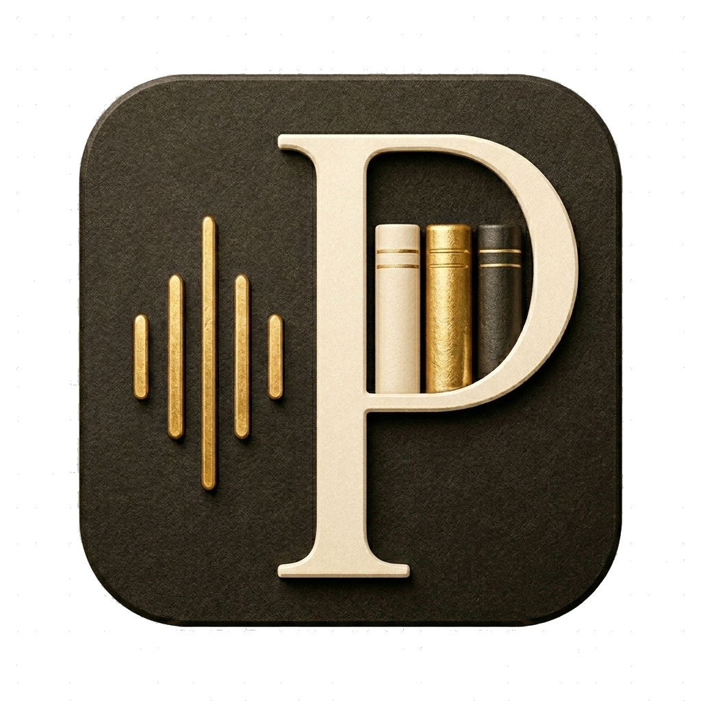
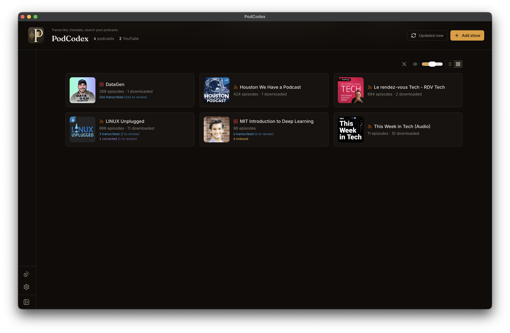
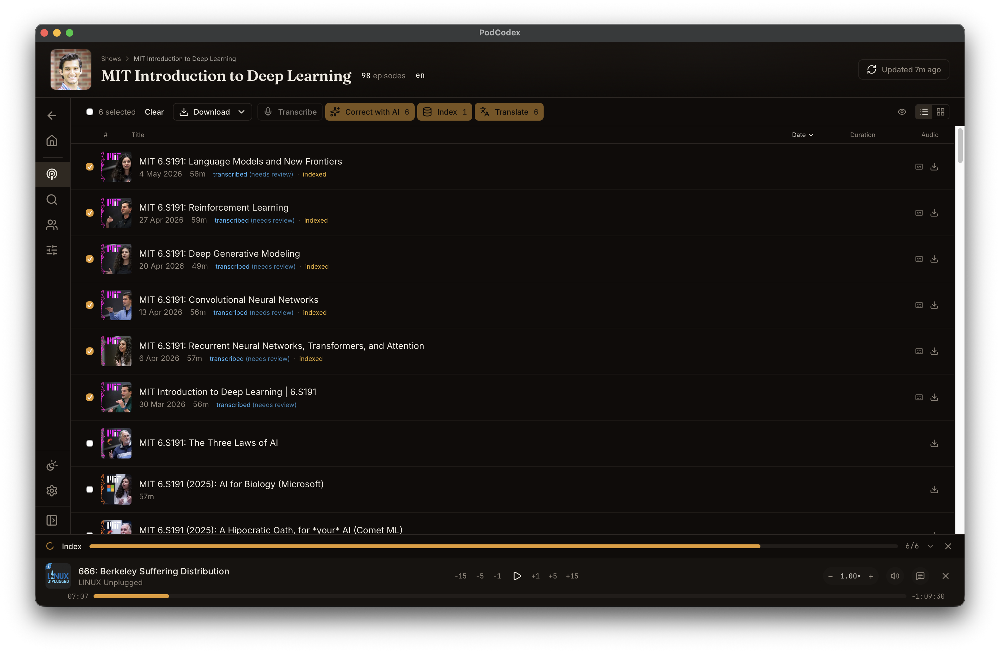
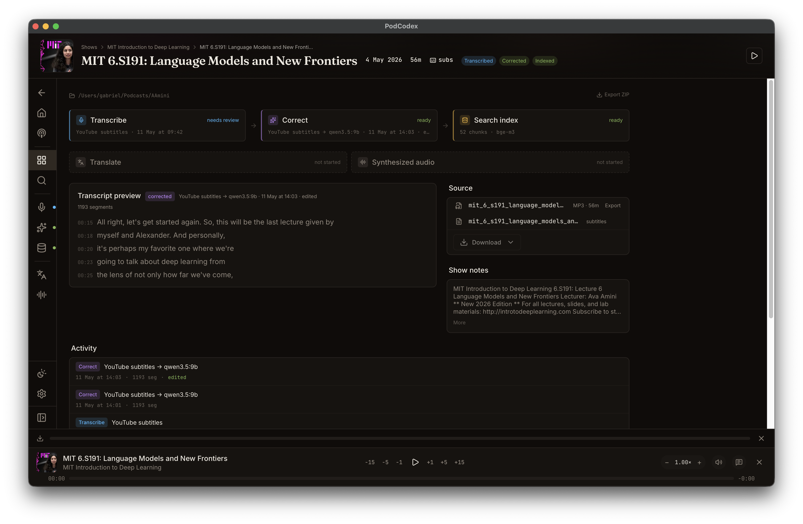
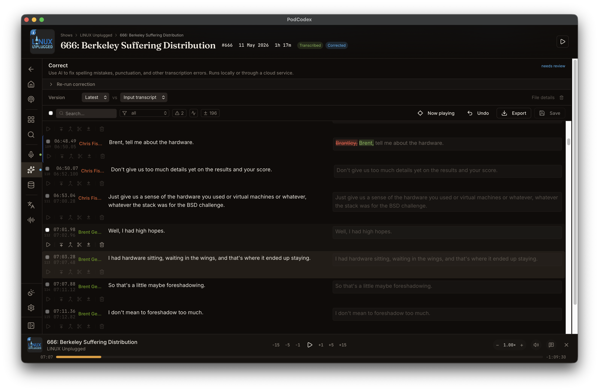
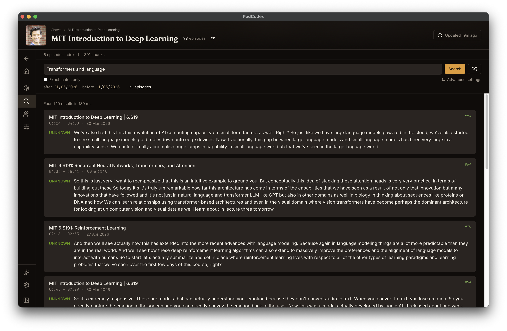

<p align="center">
  
</p>

<h1 align="center">PodCodex</h1>

<p align="center">
  <strong>Turn podcasts into a searchable knowledge base.</strong>
</p>

<p align="center">
  <a href="https://github.com/gabriel-jung/PodCodex/releases/latest">
    
  </a>
  <a href="https://github.com/gabriel-jung/PodCodex/releases">
    
  </a>
  <a href="https://github.com/gabriel-jung/PodCodex/stargazers">
    
  </a>
  <a href="LICENSE">
    
  </a>
</p>

<p align="center">
  <a href="#screenshots">Screenshots</a> •
  <a href="#what-it-does">Features</a> •
  <a href="#get-it">Download</a> •
  <a href="#integrations">Discord &amp; MCP</a> •
  <a href="ROADMAP.md">Roadmap</a> •
  <a href="CONTRIBUTING.md">Contribute</a>
</p>

With PodCodex you can produce high-quality transcriptions from any audio source, whether podcasts, YouTube channels, or your own recordings, and turn them into a local and searchable archive.

Plug it into a Discord bot or an MCP-compatible chat (Claude Desktop, Cursor, etc.) and the whole archive becomes a conversational knowledge base.

You can also translate the results into other languages, or synthesize dubbed audio through voice cloning.

---

## Screenshots

<p align="center">
  
</p>

*Library view: every podcast and YouTube channel you follow. Pipeline progress visible on each tile.*

<p align="center">
  
</p>

*Every episode of a show in one list. Select any subset and run a pipeline step on the batch.*

<p align="center">
  
</p>

*Per-episode pipeline state. Activity log records every run with its model and settings.*

<p align="center">
  
</p>

*Correct with AI editor: side-by-side diff between original and LLM corrected transcripts, inline edits, undo, export.*

<p align="center">
  
</p>

*Semantic search across the full library, with timestamps and episode context.*

Podcasts shown:

- [DataGen](https://www.datageneration.co/)
- [Houston We Have a Podcast](https://www.nasa.gov/podcasts/houston-we-have-a-podcast/)
- [Le rendez-vous Tech](https://frenchspin.fr/category/le-rdv-tech/)
- [LINUX Unplugged](https://linuxunplugged.com/)
- [MIT 6.S191: Introduction to Deep Learning](http://introtodeeplearning.com/)
- [This Week in Tech](https://twit.tv/shows/this-week-in-tech)

---

## What it does

Point it at audio. Six steps, all on your machine:

1. **Ingest**
   - As in a regular podcast app: subscribe to any show available through Apple Podcasts search or any RSS URL.
   - Follow YouTube channels, with audio and subtitle downloads.
   - Or just point it at a folder of recordings you already have.
   - Single audio files dropped onto the app are copied into a managed "Files" show inside your library folder, so they stay around like any other episode. (Before 0.2.9, dropped files were opened in place and their transcripts were written next to the source audio; those outputs are not migrated, but re-adding the original folder as a local show finds them again.)

2. **Transcribe**
   - Turn audio into a transcript using [WhisperX](https://github.com/m-bain/whisperX), with optional speaker labels from [pyannote-audio](https://github.com/pyannote/pyannote-audio).
   - Different model sizes depending on your hardware (CPU or GPU) and speed-versus-quality needs.
   - Already have subtitles? Import them (.srt, .vtt), or pull YouTube auto-subtitles directly, and skip transcription entirely.

3. **Correct**
   - Fix errors (text, speakers, timestamps) by hand in the transcript editor, with synced audio playback.
   - Or run an LLM cleanup pass: copy-paste into most LLM web chats (ChatGPT, Claude, etc.), point it at a local Ollama model, or use most LLM API keys.

4. **Index & search**
   - Search across your whole library by meaning or exact phrase.
   - Split each transcript into smaller pieces using [Chonkie](https://github.com/chonkie-inc/chonkie), and vectorize with [BGE-M3](https://huggingface.co/BAAI/bge-m3), [E5 (small / large)](https://huggingface.co/collections/intfloat/multilingual-e5-text-embeddings) or [Perplexity (0.6B / 4B)](https://huggingface.co/collections/perplexity-ai/pplx-embed) embedder models for semantic retrieval.
   - Local [LanceDB](https://github.com/lancedb/lancedb) index on your disk: stores the vectors and powers fast search.

5. **Translate** *(optional)*
   - Translate the transcript into any target language.
   - Uses the same backends as correction (web chat, local Ollama, or API key).

6. **Synthesize** *(optional)*
   - Generate dubbed audio in the target language with [Qwen3-TTS](https://huggingface.co/collections/Qwen/qwen3-tts) voice cloning.
   - Keeps the original speaker's voice.

Each step is saved with its model and settings to a SQLite database. Roll back any time, or experiment with a different setup without losing earlier runs.

---

## Get it

### Pre-built release

Direct download (latest):

- **macOS (Apple Silicon)**: [PodCodex-macos-arm64.dmg](https://github.com/gabriel-jung/PodCodex/releases/latest/download/PodCodex-macos-arm64.dmg)
- **Windows x64**: [PodCodex-windows-x64.msi](https://github.com/gabriel-jung/PodCodex/releases/latest/download/PodCodex-windows-x64.msi)

All assets + checksums on the [Releases](https://github.com/gabriel-jung/PodCodex/releases) page.

PodCodex shells out to a system [FFmpeg](https://ffmpeg.org/download.html) install for transcription, clip extraction, and synthesis. Install it before first launch (the app's first-run check surfaces a dialog if missing).

**macOS quarantine on first launch.** The DMG ships unsigned, so Gatekeeper will say *"PodCodex.app is damaged and can't be opened"*. The app is fine. Drag it to `/Applications`, then once:

```bash
xattr -dr com.apple.quarantine /Applications/PodCodex.app
```

Subsequent launches don't need it.

### Local LLM *(optional)*

"Local" correct/translate requires the [Ollama](https://ollama.com) app installed and running; models you pull there show up automatically in PodCodex. `qwen3.5:9b` ran fine on a laptop with acceptable quality; larger models produce better results.

### Hardware support

| Hardware                       | GPU support                                                                          |
|--------------------------------|--------------------------------------------------------------------------------------|
| NVIDIA RTX 20xx or newer       | Bundled installer (in-app CUDA activation, ~2.4 GB), or `--extra gpu` from source    |
| NVIDIA Pascal (GTX 10xx, P40)  | `--extra gpu-pascal` from source only, see [PASCAL.md](deploy/PASCAL.md)             |
| Apple Silicon                  | CPU only, no GPU/MPS path yet                                                        |
| Other / no GPU                 | CPU only                                                                             |

The bundled installer ships CPU-only. NVIDIA users activate the in-app CUDA backend from **Settings → GPU acceleration**; it downloads a CUDA-enabled torch build (~2.4 GB) on first activation. Force CPU at any time from the same panel.

---

## Integrations

### Discord bot

Share your archive with a small community. Drop the bot into any Discord server and listeners can run slash commands for semantic search (`/search`), exact phrase (`/exact`), random samples (`/random`), episode browsing (`/episodes`), speaker stats (`/speakers`), and library stats (`/stats`). Per-server passwords if you're running multiple shows on one bot.

```bash
uv sync --extra bot --extra rag
DISCORD_TOKEN=... uv run podcodex-bot
```

Full deploy guide (uv + Docker, systemd, password rotation, VPS rsync) in [`deploy/BOT.md`](deploy/BOT.md).

### MCP

PodCodex ships a Model Context Protocol server, so any MCP-compatible client (Claude Desktop, Claude Code, Cursor, Continue, Zed, and others) can search your archive mid-conversation. It exposes search, exact phrase, show listing, and context-fetch tools, plus editable slash prompts like `/brief`, `/speaker`, `/timeline`.

**Claude Desktop:** one-click setup at **Settings → Claude Desktop → Enable integration** writes the stdio config for you.

**Other clients:** point them at `http://127.0.0.1:18811/mcp` (HTTP transport, while the app is running), or run the server manually over stdio. See [`deploy/MCP.md`](deploy/MCP.md).

---

## Notes & caveats

- YouTube auto-generated subtitles need [deno](https://deno.com/) installed (yt-dlp hands the JS challenge off to it). Manual subtitles work fine without.
- Ollama correct/translate needs a model with reliable structured-output support; small models tend to break the JSON format.
- Qwen3-TTS needs CUDA for reasonable synthesis speed.

---

## For contributors

Start with [CONTRIBUTING.md](CONTRIBUTING.md). System wiring in [ARCHITECTURE.md](ARCHITECTURE.md). AI assistant context in [CLAUDE.md](CLAUDE.md). Frontend design rules in [DESIGN.md](DESIGN.md). ML stack pins, cache layout, and runtime patches in [ML_RUNTIME.md](ML_RUNTIME.md).

### Build from source

You'll need:

- **[uv](https://docs.astral.sh/uv/)**: handles Python 3.12 install + dependencies.
- **[Node.js](https://nodejs.org/) LTS**: frontend (or via nvm, Homebrew, winget, etc.).
- **[Rust](https://www.rust-lang.org/)** *(optional)*: for the native Tauri window.

Plus the same runtime prerequisites as [Get it](#get-it).

**Install:**

```bash
git clone https://github.com/gabriel-jung/PodCodex && cd PodCodex
make setup          # uv sync + npm install
```

**Run the app:**

Browser only (no Rust, faster to try):

```bash
make dev-no-tauri
```

Native Tauri window (needs Rust):

```bash
make dev
```

More on building and signing in [`deploy/BUILD.md`](deploy/BUILD.md).

### Tech stack

| Layer          | Technology                                                                                                |
|----------------|-----------------------------------------------------------------------------------------------------------|
| Desktop shell  | [Tauri v2](https://tauri.app) (Rust)                                                                      |
| Frontend       | [React 19](https://react.dev), [Vite](https://vitejs.dev), [TypeScript](https://www.typescriptlang.org), [Tailwind](https://tailwindcss.com), [shadcn/ui](https://ui.shadcn.com) |
| Backend        | [FastAPI](https://fastapi.tiangolo.com) (REST + WebSocket, background tasks)                              |
| Ingest         | [yt-dlp](https://github.com/yt-dlp/yt-dlp), [feedparser](https://github.com/kurtmckee/feedparser), system [FFmpeg](https://ffmpeg.org/) |
| Transcription  | [WhisperX](https://github.com/m-bain/whisperX), [pyannote-audio](https://github.com/pyannote/pyannote-audio) |
| LLM            | [Ollama](https://ollama.com) (local), [OpenAI](https://openai.com), [Anthropic](https://anthropic.com), [Mistral](https://mistral.ai), [DeepSeek](https://deepseek.com), and others; or any OpenAI-compatible API |
| Voice cloning  | [Qwen3-TTS](https://huggingface.co/collections/Qwen/qwen3-tts)                                            |
| Search         | [LanceDB](https://github.com/lancedb/lancedb), [BGE-M3](https://huggingface.co/BAAI/bge-m3) / [E5](https://huggingface.co/collections/intfloat/multilingual-e5-text-embeddings) / [Perplexity](https://huggingface.co/collections/perplexity-ai/pplx-embed) embedders, [Chonkie](https://github.com/chonkie-inc/chonkie) chunker |
| State          | [SQLite](https://sqlite.org)                                                                              |

---

## Roadmap

See [ROADMAP.md](ROADMAP.md) for what's next and longer-term plans. Shipped features live in [CHANGELOG.md](CHANGELOG.md).

---

## License

MIT. See [LICENSE](LICENSE).
